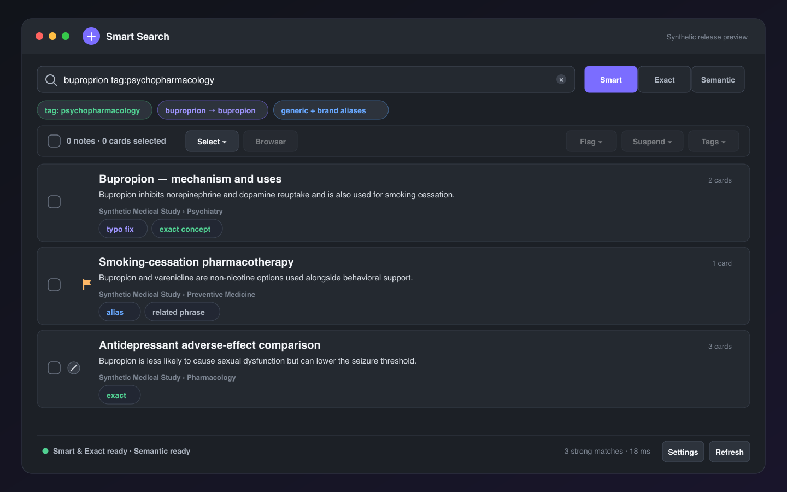
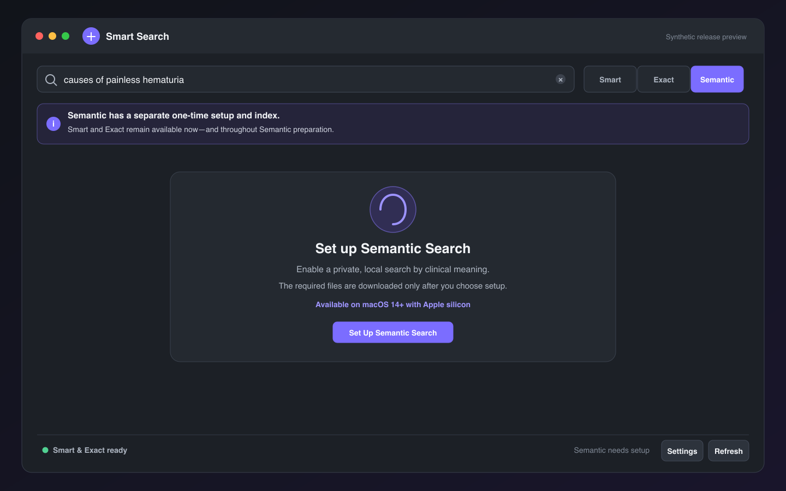
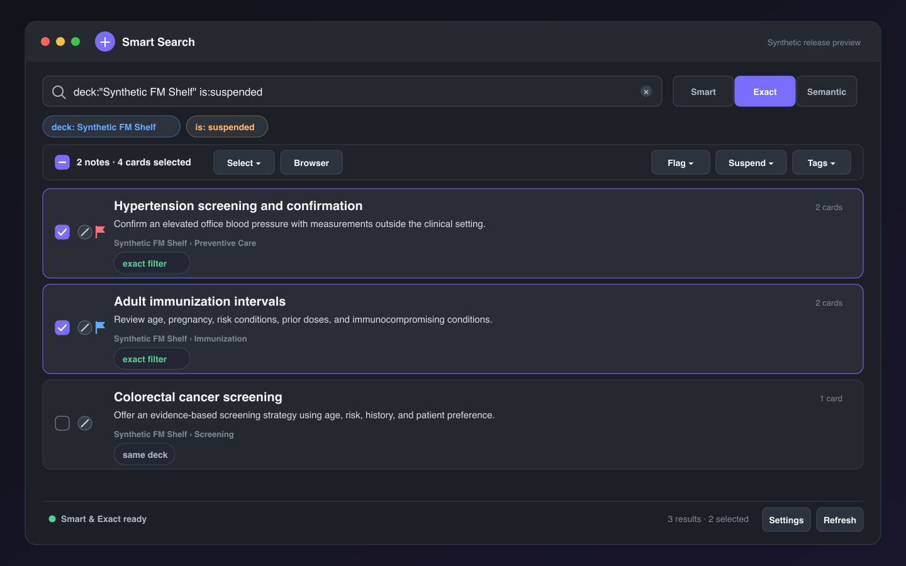
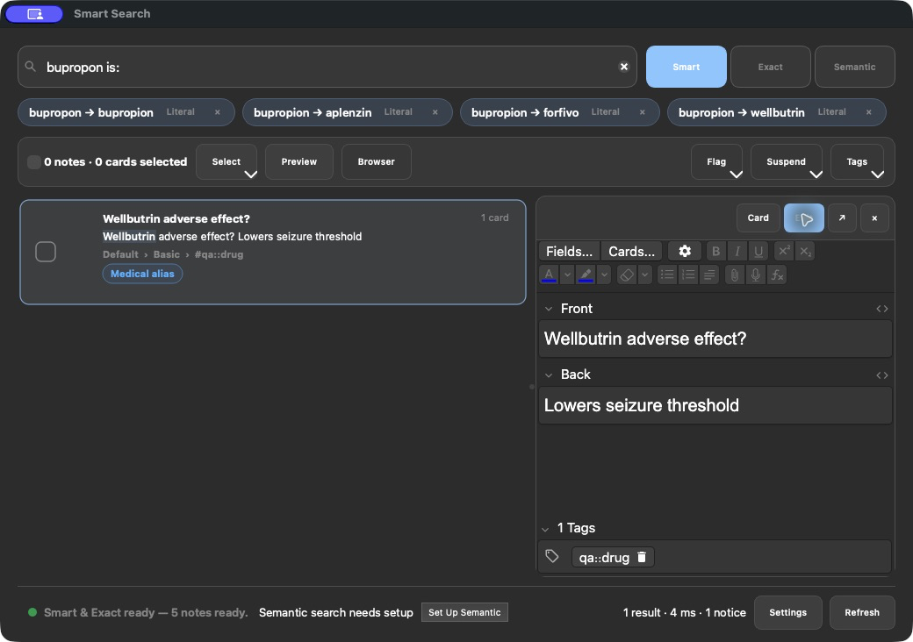

# Smart Search for Anki — Medical

Fast, forgiving medical search for Anki Desktop—with native filters, local
semantic search, and safe card actions.

Created by **Saleh Mostafa** with [MedBrevia](https://medbrevia.com/app).

> **Distribution:** the public beta is available from
> [AnkiWeb](https://ankiweb.net/shared/info/677438639). Install it with add-on
> code **677438639**. The frozen release archive is also available through
> GitHub Releases.



## Find the card you meant

Open the palette with **Command-K** on macOS or **Ctrl-K** on Windows/Linux,
type naturally, and press **Return** to open the result in Anki's Browser.

- `buproprion` can find **bupropion**.
- A supported brand name can find its generic medication.
- Search is case-insensitive by default.
- Native filters such as `deck:`, `tag:`, `note:`, `is:`, `flag:`, `prop:`,
  `rated:`, field searches, Boolean groups, and wildcards are delegated to
  Anki.
- In Smart and Semantic modes, simple filters constrain the final eligible
  cards without changing the free-text relevance calculation.
- Card-specific filters return only the sibling cards that actually match.
- Choose one or several nested decks from the searchable deck picker without
  having to remember or type their full paths.
- Adaptive relevance cutoffs remove weak trailing results instead of filling
  the list to an arbitrary maximum.

### Three useful modes

| Mode | Best for | Network/model required |
| --- | --- | --- |
| **Smart** | Typos, medical aliases, phrases, and everyday retrieval | No |
| **Exact** | Literal text and full native Anki search syntax | No |
| **Semantic** | Finding cards by clinical meaning | One explicit local setup |

Smart/Exact and Semantic use separate local indexes. Smart and Exact remain
usable while Semantic prepares.



## Work with results without losing context

- Move into the result list and the rendered inline card preview opens
  automatically; disable it or choose whether new previews start on the
  question, answer, or editable fields in **Search Settings**.
- Press **Space** or **Right Arrow** to reveal the selected card's answer;
  press **Left Arrow** to return to its front. These controls keep working
  after you click inside the rendered card.
- Preview and edit the selected card in a resizable pane without leaving the
  search window; close it temporarily or expand it when more room is useful.
- See compact suspension and flag indicators on each result.
- Flag, suspension, and tag changes keep the current list in place; press
  **Enter** or search again whenever you want filters to be reapplied.
- Undo the latest Smart Search collection action directly from the result
  toolbar; the button disables itself if another Anki change happens first.
- Check one result, Shift-click a range, or choose **All shown**, **None**, or
  **Invert**.
- Choose **Related** for the highlighted or checked results to find notes that
  share the same complete UWorld or AMBOSS source tag. Related matches can
  come from any deck, show why they matched, and open as a temporary view;
  **Back to search** restores the prior results and selection without rerunning
  the query.
- Open exactly the checked cards in Anki's Browser.
- Flag, suspend, unsuspend, add tags, or remove tags from the toolbar or
  right-click menu. The right-click menu can also bury/unbury cards or move the
  exact selection with a searchable hierarchical destination picker.
- Right-click one note and choose **Create Copy…** to open Anki's native Add
  Cards editor prefilled with its fields, tags, media references, and home
  deck. The copy is created only after you click **Add** and starts with fresh
  scheduling.
- Review the live selection summary before acting; tags apply to notes, while
  flags, suspension, burial, and deck moves apply to cards.

Every collection change uses Anki's supported, undoable operations and creates
one clean Undo step per action. Smart Search never writes directly to
`collection.anki2`.





## Privacy by design

Search, typo recovery, alias expansion, indexing, and semantic inference run on
the user's computer.

- No Smart Search account
- No analytics, advertising, telemetry, or crash reporting
- No upload of card text, queries, tags, deck names, profile names, or
  embeddings
- No automatic model installation

Anki may check AnkiWeb for compatible add-on updates. Public installations also
offer **Check & Update** in the About tab; it uses Anki's native updater and
never sends card content or search queries.

When the user explicitly starts Semantic setup, the add-on downloads pinned
model/tokenizer files over HTTPS and verifies their SHA-256 digests. Ordinary
request metadata such as an IP address and user-agent can be visible to the
download host; no Anki content or query is included.

Semantic inference runs in a local, short-lived worker process. Card text and
embeddings travel only through local operating-system pipes; the worker does
not open a network service. Exiting it lets macOS reclaim the model and native
inference libraries instead of retaining them inside Anki.

The local full-text index contains searchable copies of note/card content and
metadata. The vector index contains embeddings derived from note text. Treat
both with the same privacy as the Anki profile.

Read the complete [privacy notice](PRIVACY.md), [data-source record](DATA_SOURCES.md),
and [third-party notices](THIRD_PARTY_NOTICES.md). The intended hosted notice is
`https://medbrevia.com/legal/smart-search-privacy`.

## Compatibility

- **Host:** Anki Desktop only. Desktop add-ons do not run inside AnkiMobile or
  AnkiDroid.
- **Anki:** Anki Desktop **24.11 through 26.08**, including the 25.02, 25.07,
  25.09, 26.05, and 26.08 release families.
- **Tested host:** The supported-version matrix is exercised on macOS with
  Apple silicon. Smart and Exact do not load the
  optional platform-specific Semantic runtime, but Windows, Linux, and Intel
  Mac integration testing is not part of this release's support claim.
- **Semantic:** macOS 14 or later on Apple-silicon Macs only for this release.
- On Windows, Linux, Intel Mac, or a Mac below macOS 14, Semantic is unavailable
  gracefully while Smart and Exact remain usable.

See [Known limitations](release/KNOWN_LIMITATIONS.md) for the practical
boundaries around indexes, sync, ranking, and collection operations.

## Installation

### AnkiWeb public beta

1. In a supported Anki Desktop release, choose **Tools → Add-ons → Get Add-ons…**.
2. Enter code **677438639** and complete the installation.
3. Restart Anki, then press **Command/Ctrl-K**.

The live listing is <https://ankiweb.net/shared/info/677438639>. Installation by
that numeric code was verified in a fresh disposable Anki base: the installed
folder was `677438639`, Smart and Exact search worked, the inline preview
rendered both front and answer, and Semantic remained opt-in without downloading
a model.

### Install from the frozen archive

The exact signed-off `.ankiaddon` remains available from
[GitHub Releases](https://github.com/salehsquared/smart-search-for-anki-medical/releases).
In Anki, choose **Tools → Add-ons → Install from file…**, select the archive,
and restart.

If you previously installed a manually shared development build, remove or
disable that copy before installing the AnkiWeb version. Loading both the named
development folder and AnkiWeb's numeric folder would register the add-on
twice. Local indexes are disposable and may be rebuilt safely.

### Development checkout

Clone the repository, then run the validation and package builder:

```sh
python3 -m pip install -r scripts/requirements-test.txt
python3 -m unittest discover -s tests -t . -p 'test_*.py' -v
python3 scripts/build_addon.py
```

The builder:

- starts from an explicit public-file allowlist;
- excludes local models, expanded runtimes, indexes, caches, logs, profiles,
  collection databases, credentials, and historical builds;
- verifies every reviewed binary by SHA-256;
- compiles all packaged Python;
- validates resources, licenses, wheel CRCs, standalone-runtime size and
  structure, archive paths and links, manifest parity, and a 64 MiB regression
  ceiling; and
- writes a SHA-256 checksum beside the deterministic archive.

## Keyboard reference

- **Command/Ctrl-K:** open or focus Smart Search
- **Up/Down** or **Control-J/Control-K:** move through results; the open preview follows
- **Space/Right Arrow:** show the highlighted card's answer, including when
  the rendered card has focus
- **Left Arrow:** return to the highlighted card's front
- **Return:** open the highlighted result in Anki's Browser
- **Control-Shift-P:** open or close the inline card preview
- **Command/Ctrl-Return:** open checked results, or all shown when none are
  checked
- **Shift-Space:** check or uncheck the focused result
- **Shift-click:** select a continuous range
- **Command/Ctrl-1, 2, or 3:** switch Smart, Exact, or Semantic
- **Escape:** clear the query or close the palette
- **Escape in Related view:** return to the original search results

## Architecture and safety

The add-on reads exact changed notes and compact metadata manifests through
Anki while Anki owns the collection connection. External SQLite work, text
processing, spelling vocabulary construction, model inference, profile
initialization, and cleanup run outside Anki's graphical interface thread.

Reviewing has an explicit performance embargo: card answers schedule no search
maintenance, the Semantic worker is not allowed to remain resident, and
pending edit/sync work resumes only after the reviewer closes and the interface
has settled.

Model inference is isolated in a pinned standalone Python 3.13 worker with one
ONNX thread, single-sequence inference, bounded input messages, and a 256 MiB
macOS process-memory ceiling. The worker starts only for Semantic work and
exits afterward, allowing the operating system to reclaim its model, ONNX
Runtime, and Tokenizers memory. The Anki process receives only a bounded,
NumPy-based vector-index layer; it never imports those inference libraries.

Adds, edits, and deletes normally refresh only affected notes. Operations for
which Anki does not expose stable affected IDs—such as sync, imports, native
bulk edits, undo/redo, and structural deck/note-type changes—schedule a compact
manifest audit, then hydrate only the affected notes in bounded batches.

Indexes are disposable and profile-scoped under `user_files/`. They are not
added to `collection.anki2` and are not synced by Smart Search.

## Medical terminology and model provenance

- RxTerms 202607 alias snapshot, U.S. National Library of Medicine
- [MedEmbed-small-v0.1 reproducible ONNX INT8 export](https://huggingface.co/medbrevia/medembed-small-v0.1-onnx-int8),
  based on BAAI BGE small English v1.5
- Reproducible CLS-pooled, L2-normalized INT8 ONNX export for local inference
- NumPy, ONNX Runtime, Hugging Face Tokenizers, and FlatBuffers
- Pinned python-build-standalone CPython 3.13 worker for reclaimable inference

These components improve retrieval; they do not verify that a card is current
or medically correct. Search results are not medical advice.

Exact versions, transforms, licenses, checksums, limitations, and required NLM
attribution are recorded in [DATA_SOURCES.md](DATA_SOURCES.md) and
[THIRD_PARTY_NOTICES.md](THIRD_PARTY_NOTICES.md).

## Support and contribution

- [Support](SUPPORT.md)
- [Security reports](SECURITY.md)
- [Contributing](CONTRIBUTING.md)
- Private feedback: `product@medbrevia.com`

Use synthetic or fully redacted examples. Never attach an Anki collection,
profile folder, search database, vector index, patient information, credentials,
or identifiable card content to a public issue.

## License

Original add-on code and documentation are available under the
[MIT License](LICENSE.txt). Third-party components retain their own licenses and
notices.

Smart Search is an independent Anki add-on and is not affiliated with or
endorsed by Anki or AnkiWeb.
